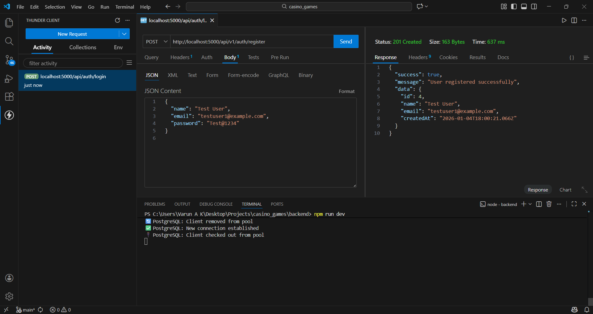
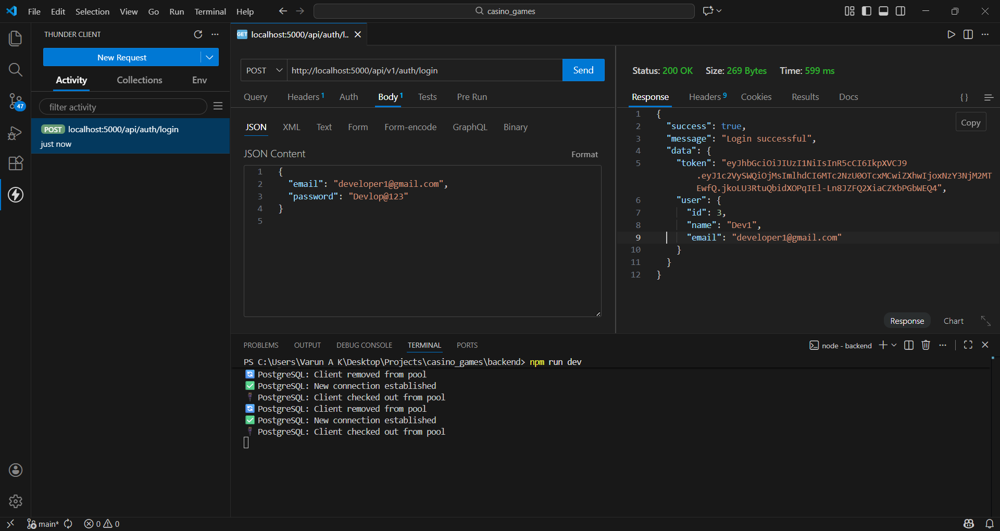
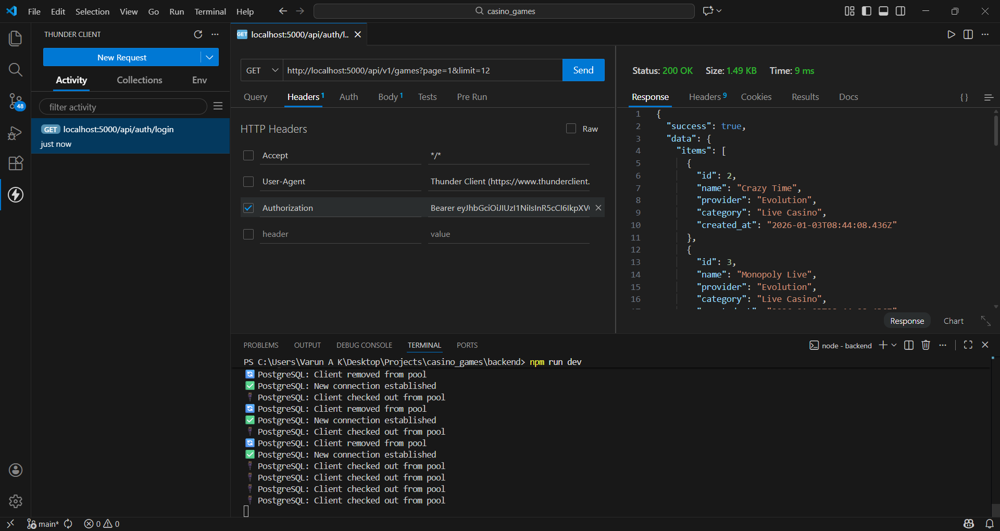
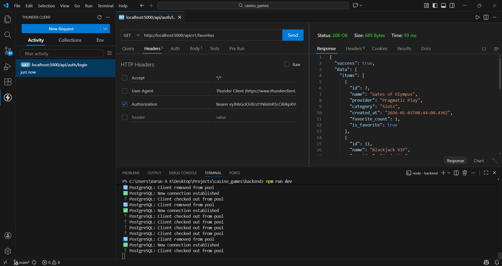

# 🎰 Casino Games Platform

A **production-grade full-stack Casino Games Platform** with **secure authentication**, **paginated game browsing**, **advanced filtering**, and **user favorites**. Built following enterprise architecture patterns with clean separation of concerns, robust error handling, and performant data fetching.

## ✨ Features

- 🔐 **Secure JWT Authentication** with HTTP-only cookies, bcrypt hashing, and protected API routes
- 🎮 **Casino Game Browsing** with glassmorphism UI, hover animations, and responsive grid layout
- 📊 **Server-Side Pagination** (`page`, `limit`) with metadata (`total`, `pages`, `current_page`)
- 🔍 **Advanced Filtering** by provider, category, and full-text search with debounced input
- ❤️ **Favorites System** with optimistic UI updates, 409 conflict handling, and real-time sync
- ⚡ **Custom React Hooks** (`useGames`, `useFavorites`) for data fetching and state management
- 🛡️ **Protected Routes** with automatic redirects and token refresh logic
- 🎨 **Production UI** with TailwindCSS, Framer Motion animations, and accessibility
- 🗄️ **PostgreSQL Backend** with connection pooling, optimized queries, and proper indexing
- 📱 **Fully Responsive** across desktop, tablet, and mobile devices

## 🚀 Tech Stack

### Backend
| Technology | Purpose |
|------------|---------|
| **Node.js** | Runtime |
| **Express.js** | API Framework |
| **PostgreSQL** | Database |
| **pg** | Postgres Client (Connection Pool) |
| **jsonwebtoken** | JWT Tokens |
| **bcryptjs** | Password Hashing |
| **dotenv** | Environment Variables |
| **cors** | Cross-Origin Requests |

### Frontend
| Technology | Purpose |
|------------|---------|
| **React 18** | UI Library |
| **Vite** | Build Tool |
| **React Router v6** | Client-Side Routing |
| **Axios** | HTTP Client |
| **React Context** | State Management |
| **Framer Motion** | Animations |
| **@iconify/react** | SVG Icons |
| **TailwindCSS** | Styling |

## 📁 Project Structure

casino-games-platform/
│
├── backend/
│ ├── seed/
│ │ └── seedGames.js # Populates 25+ casino games
│ ├── src/
│ │ ├── config/
│ │ │ ├── db.js # Postgres pool + migrations
│ │ │ └── env.js # Environment validation
│ │ ├── middlewares/
│ │ │ ├── auth.js # JWT verification
│ │ │ └── error.js # Global error handler
│ │ ├── modules/
│ │ │ ├── auth/ # Registration, login
│ │ │ ├── games/ # Listing, filtering
│ │ │ └── favorites/ # User favorites
│ │ ├── utils/
│ │ │ ├── jwt.js # Token utilities
│ │ │ └── password.js # Hashing/verification
│ │ ├── app.js # Express app setup
│ │ └── server.js # Server entrypoint
│ ├── .env.example
│ ├── package.json
│ └── server.js
│
├── frontend/
│ ├── public/
│ │ └── casino-bg.jpg # Hero background
│ ├── src/
│ │ ├── api/
│ │ │ └── client.js # Axios interceptor + auth headers
│ │ ├── auth/
│ │ │ ├── AuthContext.jsx # JWT storage + auth state
│ │ │ └── ProtectedRoute.jsx# Route guards
│ │ ├── components/
│ │ │ ├── GameCard/ # Game cards with favorites
│ │ │ ├── FilterBar/ # Search + provider/category
│ │ │ ├── Pagination/ # Page navigation
│ │ │ ├── Navbar/ # Responsive nav
│ │ │ ├── Loader/ # Spinners + skeletons
│ │ │ ├── ErrorState/ # Error boundaries
│ │ │ └── EmptyState/ # No results UX
│ │ ├── hooks/
│ │ │ ├── useGames.js # Games + pagination
│ │ │ └── useFavorites.js # User favorites
│ │ ├── pages/
│ │ │ ├── Login.jsx
│ │ │ ├── Register.jsx
│ │ │ ├── Games.jsx # Main listing page
│ │ │ └── Favorites.jsx # User favorites page
│ │ ├── App.jsx
│ │ ├── main.jsx
│ │ └── index.css # Global styles + CSS vars
│ ├── .env.example
│ ├── vite.config.js
│ └── package.json
│
├── README.md
├── docker-compose.yml
└── .gitignore

text

## 🌐 API Specification

### Authentication
| Method | Endpoint | Auth | Request Body | Response |
|--------|----------|------|--------------|----------|
| `POST` | `/api/v1/auth/register` | - | `{email, password}` | `{token, user}` |
| `POST` | `/api/v1/auth/login` | - | `{email, password}` | `{token, user}` |

### Games (Public)
| Method | Endpoint | Auth | Query Params | Response |
|--------|----------|------|--------------|----------|
| `GET` | `/api/v1/games` | - | `page`, `limit`, `search`, `provider`, `category` | `{data: {items: [], pagination: {}}}` |

**Pagination Response**:
```json
{
  "success": true,
  "data": {
    "items": [
      {
        "id": 1,
        "name": "Monopoly Live",
        "provider": "Evolution",
        "category": "Live Casino",
        "image_url": "...",
        "is_favorite": false,
        "favorite_count": 42
      }
    ],
    "pagination": {
      "total": 25,
      "page": 1,
      "pages": 3,
      "limit": 12
    }
  }
}
Favorites (Protected)
Method	Endpoint	Auth	Description	Response
POST	/api/v1/favorites/:gameId	✅	Add to favorites	{success: true}
DELETE	/api/v1/favorites/:gameId	✅	Remove favorite	{success: true}
GET	/api/v1/favorites	✅	List favorites	Same as games
🚀 Quick Start
Prerequisites
Node.js 18+

PostgreSQL 14+

Docker (optional)

Backend Setup
bash
cd backend
cp .env.example .env
# Edit .env with your DB credentials
npm install
npm run dev
Seed Database (25+ casino games):

bash
node seed/seedGames.js
Frontend Setup
bash
cd frontend
cp .env.example .env
# Set VITE_API_BASE_URL=http://localhost:5000/api/v1
npm install
npm run dev
Docker (Optional)
bash
docker-compose up -d
🛠️ Development Workflow
Backend Hot Reload
bash
npm run dev  # nodemon auto-restarts
Frontend Hot Reload
bash
npm run dev  # Vite HMR
Testing
bash
# Backend
npm test

# Frontend
npm run test:unit
npm run test:e2e

## API Testing (Thunder Client)
All backend APIs were tested using Thunder Client.
Screenshots are attached below as proof of correctness.

📱 Screenshots





Games Listing	Favorites Page	Filter Bar
Games	Favorites	Filter
📊 Database Seeding
Run this to populate 25+ realistic casino games:

bash
cd backend
node seed/seedGames.js
Sample Games Seeded:

Monopoly Live (Evolution, Live Casino)

Mega Ball (Evolution, Live Casino)

Dream Catcher (Evolution, Live Casino)

Lightning Roulette (Evolution, Live Casino)

Blackjack Live (Pragmatic Play, Live Casino)

Starburst (NetEnt, Slots)

Gonzo's Quest (NetEnt, Slots)

...and 20+ more!

🧪 Testing Strategy
Backend (Jest + Supertest)
bash
npm test
80%+ code coverage

Unit tests for services

Integration tests for endpoints

Database tests with test container

Frontend (Vitest + React Testing Library)
bash
npm run test
Component snapshot tests

User interaction tests

API mocking with MSW

🔒 Security Checklist
 Passwords hashed with bcrypt (12 rounds)

 JWT tokens with short expiry (1d)

 CORS restricted to frontend origin

 Helmet security headers

 SQL injection prevention (parameterized queries)

 Rate limiting middleware

 Input validation with Joi/Zod

 Protected routes with auth middleware

📈 Performance Optimizations
Backend:

Connection pooling with pg.Pool

Database indexes on filter columns

Efficient COUNT(*) with subqueries for favorite_count

JSONB for flexible game metadata

Frontend:

React.memo on GameCard

useCallback/useMemo in hooks

Lazy loading for game images

Debounced search (400ms)

Virtualized list for 1000+ games